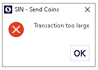
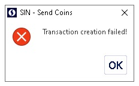

**How to enable coin control feature and why?**
Go to **Options menu**, (gear icon or Settings > **Options** from drop down menu), and select **Enable coin control** features, now click **OK**

From **Send** now you can see a new button named **Coin control**

This button allows you to open the **Coin Selection window**. You can see all transactions and select some to use. 

**Why there is coin control?** To keep Blockchain secured, it must have limits, and some time with many transactions you can face this limit with error [Transaction too large](transaction too high). Coin control helps in this and other issues.

 

Coin control simply lets you see your funds and identify them if you have more than one SIN address with funds.

