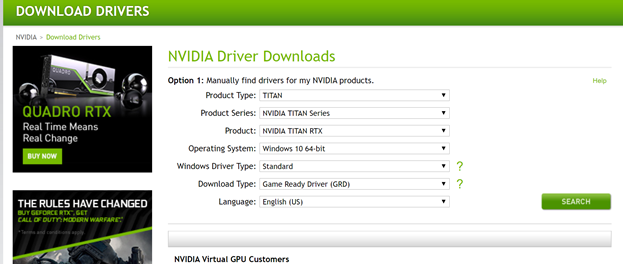
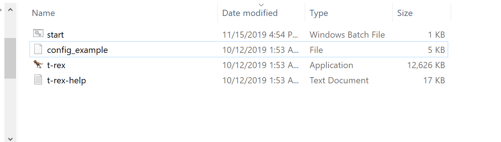
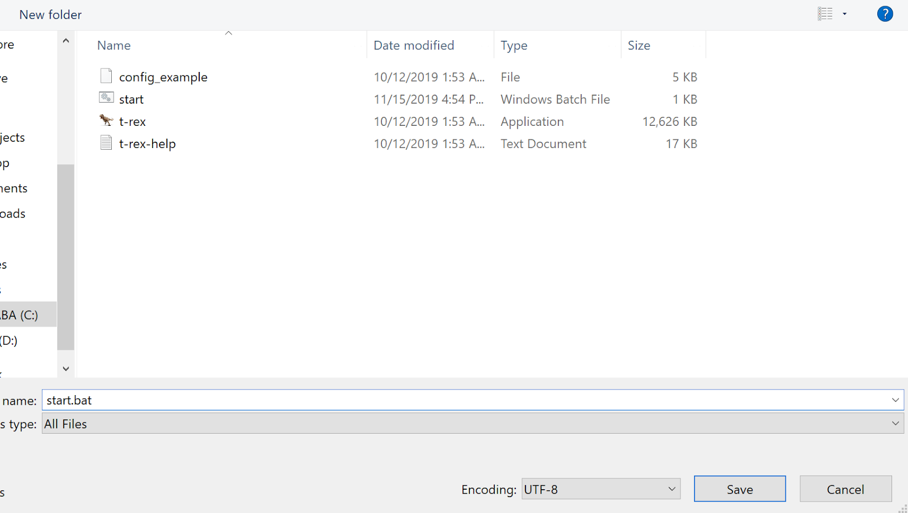
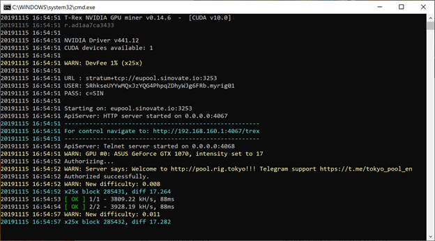

SIN (X25X Algo) T-Rex Miner Kullanarak Madencilik

1-  T-Rex Miner son sürümünü edinin

Nvidia grafik kartınıza uygun T-Rex Miner sürümünü indirin.

Cuda 10 versiyonu önerilir.

[https://trex-miner.com/download/t-rex-0.19.14-linux-cuda10.0.tar.gz](https://trex-miner.com/download/t-rex-0.19.14-linux-cuda10.0.tar.gz)

[https://trex-miner.com/download/t-rex-0.19.14-linux-cuda11.1.tar.gz](https://trex-miner.com/download/t-rex-0.19.14-linux-cuda11.1.tar.gz)

[https://trex-miner.com/download/t-rex-0.19.14-linux-cuda9.2.tar.gz](https://trex-miner.com/download/t-rex-0.19.14-linux-cuda9.2.tar.gz)

[https://trex-miner.com/download/t-rex-0.19.14-win-cuda10.0.zip](https://trex-miner.com/download/t-rex-0.19.14-win-cuda10.0.zip)

[https://trex-miner.com/download/t-rex-0.19.14-win-cuda11.1.zip](https://trex-miner.com/download/t-rex-0.19.14-win-cuda11.1.zip)

[https://trex-miner.com/download/t-rex-0.19.14-win-cuda9.2.zip](https://trex-miner.com/download/t-rex-0.19.14-win-cuda9.2.zip)

2-  Nvidia grafik kartı sürücünüzü güncelleyin.

Eğer grafik kartı sürücünüz güncel değilse, aşağıdaki linkten güncelemeyi indirmeniz tavsiye edilir.

[https://www.nvidia.com/Download/index.aspx?lang=en-us](https://www.nvidia.com/Download/index.aspx?lang=en-us)



  

3-  Örnek bir start.bat dosyası oluşturun.

T-Rex Miner bulunan klasöre gidiniz.



  
  
  
  

Bir text belgesi açınız.

Server adresini bulunduğunuz bölgeye göre seçiniz.

Avrupa stratum:

```bash
@echo off
:start
t-rex.exe -a x25x -o stratum+tcp://europe.miner.tokyo:3253 -u your_sin_address.your_rig_name -p c=SIN
goto start
```

Asya stratum:

```bash
@echo off
:start
t-rex.exe -a x25x -o stratum+tcp://asia.miner.tokyo:3253 -u your_sin_address.your_rig_name -p c=SIN
goto start
```

A.B.D. stratum:

```bash
@echo off
:start
t-rex.exe -a x25x -o stratum+tcp://us.miner.tokyo:3253 -u your_sin_address.your_rig_name -p c=SIN
goto start
```
Rusya stratum:

```bash
@echo off
:start
t-rex.exe -a x25x -o stratum+tcp://ru.miner.tokyo:3253 -u your_sin_address.your_rig_name -p c=SIN
goto start
```

Farklı Kaydet seçeneğiyle dosyanıza start.bat ismini vererek kaydedin.



4-  Madenciliğe başlayabilirz.

Lütfen oluşturduğunuz start.bat dosyasına çift tıklayınız. T-Rex seçtiğiniz sunucuya bağlanacak ve madencilik başlayacaktır.

  



