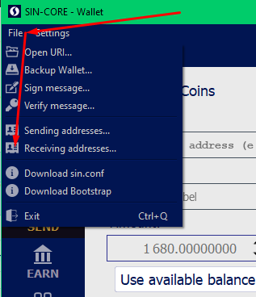
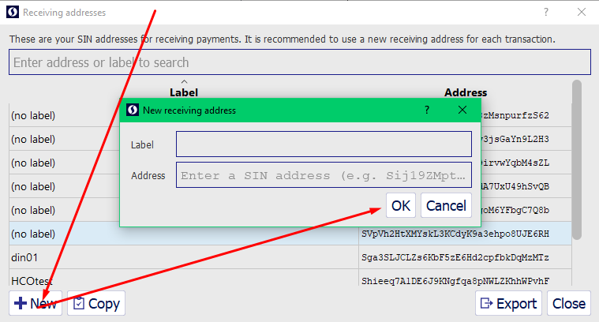
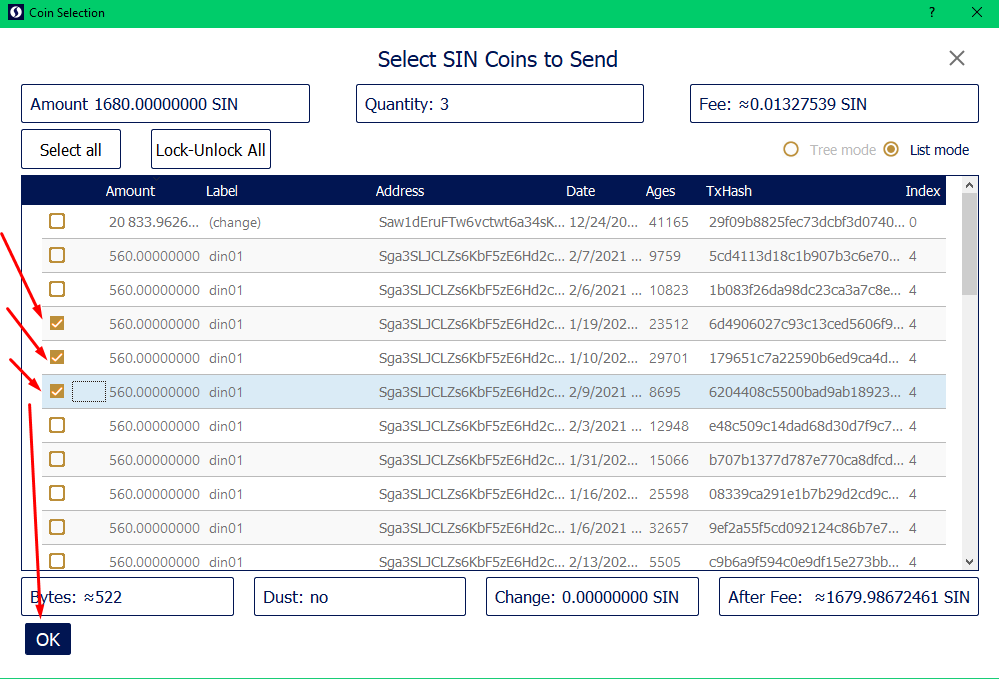
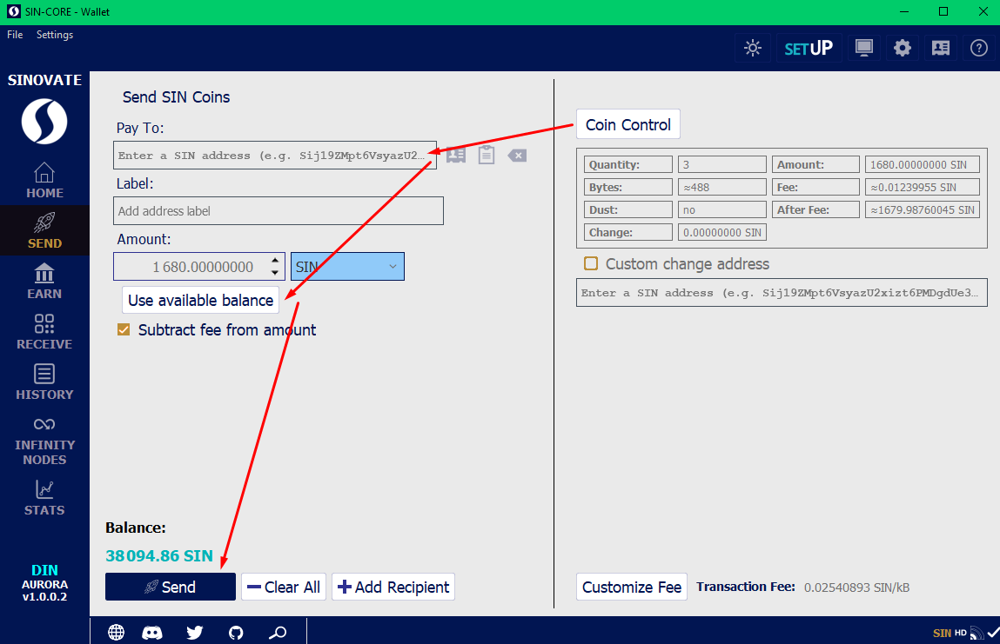

**Transaction too large / Transaction too high / Transaction creation failed**

 

Transaction too high error is a standard miners limit error first introduced with the Bitcoin core wallet.

For example, you try to burn coins or send all wallet balance, and many small transactions hit the blockchain limit error.
In that case, please use the Coin Control feature.

create a new Receiving address

please select and copy it with a right mouse click

select several addresses from [Coin control](Coincontrolenable) > Coin Selection window

and try to send several times to generated from previous step address

**The goal is to lover address count in the **Coin Selection window.****
